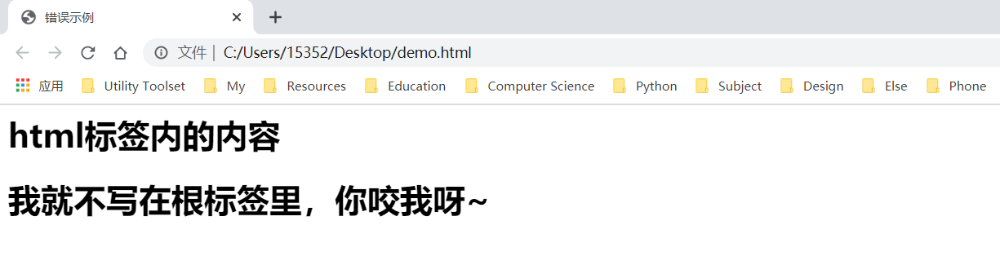
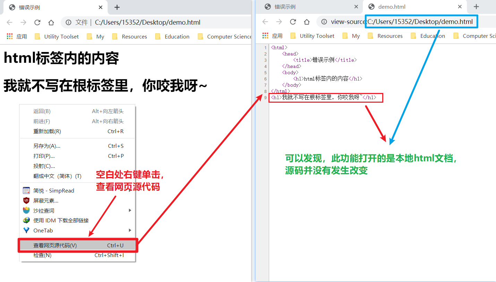
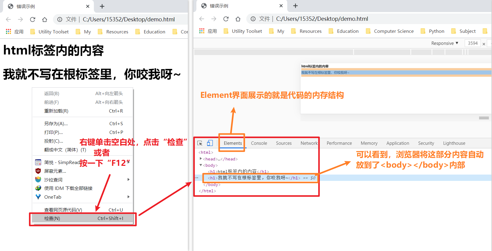
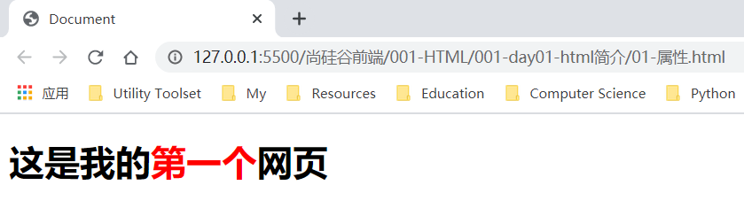
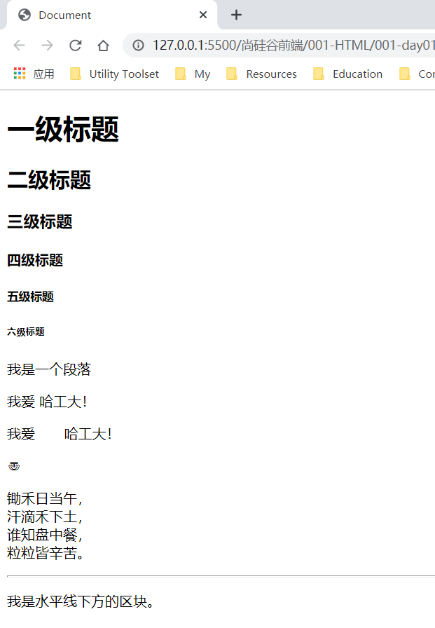
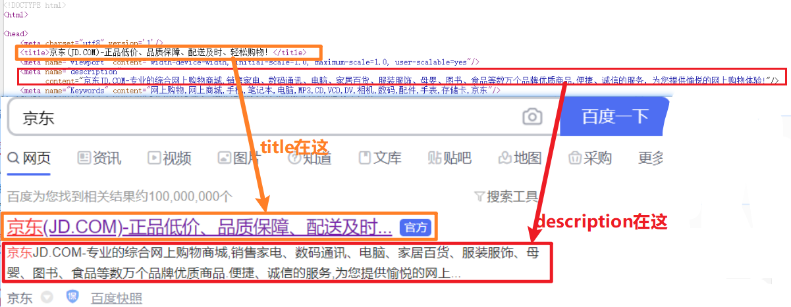
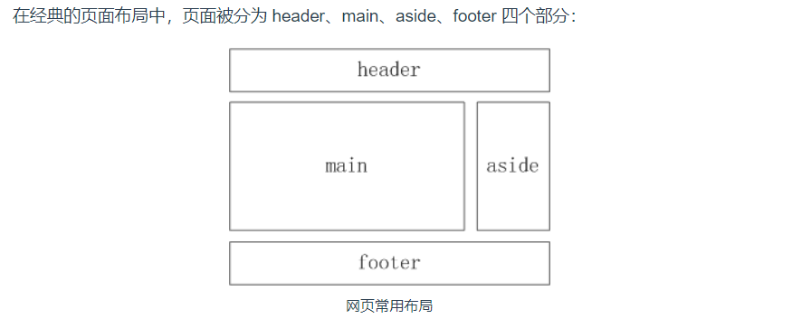
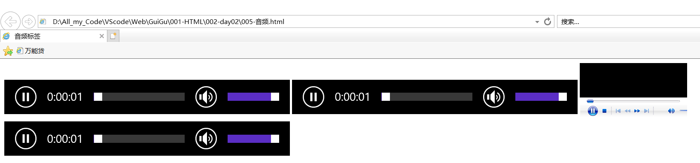
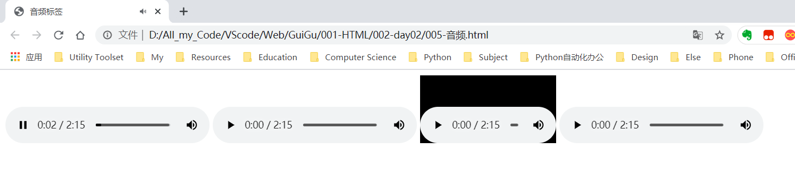
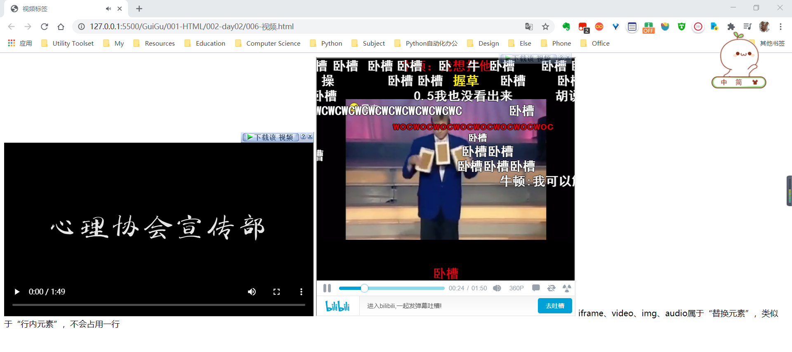

[toc]

# HTML

## 1.简介

### 1.0 Web三剑客

* 根据W3C标准，一个网页主要由3部分组成：结构、表现和行为

* 三个部分分别对应三个语言：
  * 结构：HTML
    * 标签关注的是语义，凡是为样式设计的标签，现已都**不**建议使用！
  * 表现：CSS
  * 行为：JavaScript

* HTML、CSS、JavaScript被称为“前端三剑客”。

* 一个设计优良的网页，要求结构、表现、行为三者**分离**。（因为对于一个软件来说，后期维护成本要比开发成本高，代码的耦合度越低，维护越简单，所以要求三者分离）


### 1.1 HTML概述

* HTML（Hypertext Markup Language）超文本标记语言
* 它负责网页的三个要素之中的**结构**。
* HTML使用**标签（元素）**来识别网页中不同组成部分
  * 成对标签：<标签名>内容</标签名>
  * 自结束标签
    * <标签名>
    * <标签名/>
* 所谓超文本指的是**超链接**，使用超链接可以让我们从一个页面跳转到另一个页面。


### 1.2 HTML文档框架

```html
<html>
    <head>
        <title></title>
        <!-- 这是一个注释 -->
    </head>
    
    <body>
        
    </body>
</html>
```

* `<html></html>`是根标签：所有内容都要放到`<html></html>`标签中
* `<html></html>`标签下只能有两个标签
  * `<head></head>`：
    * html的子元素/子标签，其下内容在网页中均不可见，用来对网页进行一些配置，主要有以下两种用途
      * 给浏览器看，告诉浏览器相关渲染信息
      * 给搜索引擎看，用于[SEO：搜索引擎优化](https://baike.baidu.com/item/搜索引擎优化/3132)
    * head下的常见子标签
      * `<title></title>`：
        * 网页标题，会显示在标题栏
        * 搜索引擎爬虫程序主要根据title来识别网页的主要内容（SEO人员需要特别关心）
        * 会成为搜索引擎搜索结果的链接文字
  * `<body></body>`：
    * 用户可以看到其内部内容

### 1.3 语法不严格性

先看一个错误示例：

上面我们说**`<html></html>`标签是根标签，所有元素必须放在其内部**，那如果我故意写在外面会有什么效果呢？看下面代码：

```html
<html>
	<head>
		<title>错误示例</title>
	</head>
	<body>
		<h1>html标签内的内容</h1>
	</body>
</html>
<h1>我就不写在根标签里，你咬我呀~</h1>  <!-- <h1>标签意为“一级标题” -->
```

如果这样玩，按理说浏览器不会显示根标签之外的内容，可实际确实酱紫的：



这是为什么呢？？？

原因很简单，当年浏览器大战的时候，各大浏览器都想法设法提高自己的渲染和解读能力，因此对html语法做了许多许多的容错处理，即使你写错了（标签没有闭合啦、标签放到根标签之外啦……），浏览器也会想方设法给你改错，总之一句话：**浏览器会以最大的善意理解你的HTML代码**。

但是！

这不应该成为我们任性的理由，这次浏览器给你改对了，下次可就不一定了……

浏览器自动为我们改错，是不是它偷偷把源代码改了呢？



（上图展示了如何查看网页源代码，这个是我们后期调试常用的工具，务必掌握）

源代码没有变，那浏览器在哪里做的手脚呢？

其实，浏览器没有权限更改你的源代码，它改的是**代码在内存中的结构**。看下图：



（上图展示了如何进入“调试模式”，以后我们会经常使用该模式进行代码调试，务必掌握）

综上所述，**浏览器会通过改变内存结构来对我们的HTML代码进行纠错**。


### 1.4 查看文档

文档，又名**API**（Application Program Interface）：应用程序接口

* 何为接口？
  * 接口的特点：暴露给用户、用户可以看到或直接使用
  * eg：UI（User Interface）、GUI（Graphic User Interface）
* 如何查看文档？
  * 在线：[W3school](https://www.w3school.com.cn/index.html)
  * 离线：[Zeal阅读器](https://zealdocs.org/)


## 2.基础语法

### 2.1 属性

#### 2.1.1 示例

先看代码：

```html
<!DOCTYPE html>
<html lang="en">
<head>
    <meta charset="UTF-8">
    <title>Document</title>
</head>
<body>
    <h1>这是我的<font color='red'>第一个</font>网页</h1>
    <!-- 此处修改样式的方式并不推荐，为了将“结构、样式、行为”三者解耦，所有与样式有关的内容都应交给CSS，
	所以font标签已不推荐使用！
	-->
</body>
</html>
```

效果如下：



#### 2.1.2 关于属性

**语法**

* 在标签的**开始标签**中可以为元素添加属性，用来设置元素如何显示其中的内容
* 属性是一个**名值对**结构，形式如下：**属性名=’属性值‘**，属性值需要用单引号或双引号（英文）括起来。
* 如果要为一个标签设置多个属性，则各名值对之间用**空格**分隔。


到这里或许你会问，我怎么知道有哪些属性可以用？其实很简单，HTML中有多少标签、标签有哪些属性，都可以从API中查到。经过一段时间的练习，你就会了解一些常用的标签，通常情况下，你只需知道它们大致可以干什么就可以，至于细节，无需记忆，查询API即可。


#### 2.1.3 全局属性

官网在此：[w3school全局属性](https://www.quanzhanketang.com/tags/ref_standardattributes.html) 

* class
  * class属性为元素指定一个或多个类名。
  * class属性主要用于指向样式表中的类。
  * 但是，JavaScript也可以使用它(通过HTML DOM)对指定类的HTML元素进行更改。
* id
  * 为元素指定唯一ID
* style
  * 指定内联CSS样式
* title
  * 鼠标悬停时显示的额外信息
* dir
  * 设置文本显示方向

### 2.2 常用标签和实体

#### 2.2.1 知识点

**常用标签**

* h1~h6 标题
* p：段落标签
* br：换行
* hr：水平线

**实体**

* 语法：**&实体名;**
* 常用：
  * `&nbsp;`：空格
  * `&lt;`：小于号
  * `&gt;`：大于号
  * `&copy;`：版权符号
  * `&Unicode编码;`：Unicode字符

#### 2.2.2 实例体验

```html
<!DOCTYPE html>
<html lang="en">
    <!-- 
		浏览器会根据lang属性的值来提示用户是否需要翻译。
		en：英文
		zh：中文
		……
	-->
<head>
    <!-- 自结束标签 meta用来设置网页元数据 -->
    <meta charset="UTF-8">
    <!-- charset：指定浏览器的解码标准 -->
    <title>Document</title>
</head>
<body>
    <!-- 对标签来说，样式不重要，重要的是样式 在SEO中，h1~h3是浏览器搜索重点 -->
    <h1>一级标题</h1>
    <h2>二级标题</h2>
    <h3>三级标题</h3>
    <h4>四级标题</h4>
    <h5>五级标题</h5>
    <h6>六级标题</h6>

    <!-- 段落标签 -->
    <p>我是一个段落</p>
    <!-- 
        在HTML中，多个空格和标签会被解析成“一个”空格。
        可以使用【实体】（转义字符）来表示一些特殊的符号，语法如下：
            语法：&实体的名字;
            举例：
                空格：&nbsp;
                大于：&gt;
                小于：&lt;
                版权符号：&copy;
                ……

        实体亦可显示Unicode字符（可用此方法显示一些怪异符号），语法如下：
            &#Unicode编码(此处是10进制);
    -->
    <p>我爱          哈工大！</p>
    <p>我爱&nbsp;&nbsp;&nbsp;&nbsp;&nbsp;&nbsp;&nbsp;哈工大！</p>
    <p>&#12320;</p>

    <!-- 使用<br>标签来进行换行 -->
    <p>
        锄禾日当午，<br>
        汗滴禾下土，<br>
        谁知盘中餐，<br>
        粒粒皆辛苦。
    </p>

    <!-- 
        <hr>本来表示水平线，没有语义，表现层标签均不推荐使用；
        但现在有了语义：表示分割两个区块 
    -->
    <hr>
    <p>我是水平线下方的区块。</p>

</body>
</html>
```

效果图如下：



### 2.3 meta标签

**用法**

meta的用法：https://man.ilovefishc.com/pageHTML5/meta.html

**示例**

```html
<!DOCTYPE html>
<html lang="en">
<head>
    <meta charset="utf8" version='1'/>
    <title>京东(JD.COM)-正品低价、品质保障、配送及时、轻松购物！</title>
    <meta name="viewport" content="width=device-width, initial-scale=1.0, maximum-scale=1.0, user-scalable=yes"/>
    <meta name="description"
        content="京东JD.COM-专业的综合网上购物商城,销售家电、数码通讯、电脑、家居百货、服装服饰、母婴、图书、食品等数万个品牌优质商品.便捷、诚信的服务，为您提供愉悦的网上购物体验!"/>
    <meta name="Keywords" content="网上购物,网上商城,手机,笔记本,电脑,MP3,CD,VCD,DV,相机,数码,配件,手表,存储卡,京东"/>
</head>
<body>
    
</body>
</html>
```





### 2.4 语义化标签

**常见语义化标签**



* `<header>` 标签用于定义文档的页眉（介绍信息）。
  * 常用来放置logo、导航、搜索框、广告条
* `<main>` 标签用于定义文档`<body>`或应用的主体部分。
* `<footer>` 标签定义文档或节的页脚。
  * 常用来放置版权声明、友情链接。
* `<aside>` 标签定义侧边栏，通常是网页的说明、提示、引用、附加注释、相关链接、广告等内容。


* `<nav>` 标签用于定义页面主导航功能。
* `<article>` 标签用于定义一篇文章，与页面其它部分无关。
* `<section>` 标签用于定义定义文档中的节，表示一个独立的区块。


以上标签均为HTML5新增的**语义化标签**，除了除了语义外，不会对内容格式做任何更改；而且都是块元素，在页面中会独占一行。就目前而言，实际开发中常用`<div>`标签取代上述所有语义化标签。


**代码示例**

```html
<!DOCTYPE html>
<html lang="en">

<head>
    <meta charset="UTF-8">
    <title>Document</title>
</head>

<body align=center>

    <!-- header 表示网页的头部 主要用于放置一些logo、导航、搜索框等内容 -->

    <header>
        我是网页的头部

        <!-- 表示页面的导航栏 -->
        <nav>导航栏</nav>
    </header>

    <!-- main标签表示网页中的主体内容 -->
    <main>
        我是网页的主体
        <!-- <aside> 表示网页的侧边栏 -->
        <!-- <section> 表示一块独立的区域-->

        <!--<article> 表示网页中的一块内容-->
        <article>
            <!--<hgroup> 表示标题组-->
            <hgroup>
                <h1>大标题</h1>
                <h2>小标题</h2>
            </hgroup>
            
            <h1>回乡偶遇（二首）</h1>

            <article>
                <h2>其一</h2>
                <p>
                    少小离家老大回 <br>
                    乡音无改鬓毛衰 <br>
                    儿童相见不相识 <br>
                    笑问客从何处来 <br>
                </p>
            </article>

            <article>
                <h2>其二</h2>
                <p>
                    锄禾日当午 <br>
                    汗滴禾下土 <br>
                    谁知盘中餐 <br>
                    粒粒皆辛苦 <br>
                </p>
            </article>


        </article>

    </main>

    <!-- footer标签表示网页的底部，footer主要放置一些版权信息、友情链接、联系方式 ...   -->
    <footer>
        网页的底部
    </footer>

    <!--    
    以上标签都是H5新增的语义化标签，他们并不能支持所有的浏览器，
        所以基本上这些东西都是必须使用的，如果有nav标签会使用的比较多
        所以基本上可以使用div来代替以上所有标签
        
    块元素（block element） 块元素会在网页中独占一行         
    -->

</body>

</html>
```


### 2.5 图片标签

#### 2.5.1 ``标签

```html
<!DOCTYPE html>
<html lang="en">

<head>
    <meta charset="UTF-8">
    <title>图片标签</title>
</head>

<body>
    <!--   图片标签用来向页面中引入一个外部图片 
        使用img标签来引入外部图片
        属性：
            src 图片的路径
            alt 图片的描述
                这个描述不会在页面中显示
                但是有可能在图片无法加载时显示
                
                搜索引擎会根据alt属性来判断图片的内容
                    如果没有alt属性搜索引擎不会对图片进行收录

            width 图片的宽度
            height 图片的高度
                宽度和高度如果只修改一个，则另一个会等比例缩放。
   -->
    
    
</body>
</html>
```

#### 2.5.2 文件路径

* 以文件方式访问HTML：能访问到计算机上任意位置的图片资源。

*  将HTML文档放在服务器中运行：当图片位于项目文件夹之外时，便访问不到了。

#### 2.5.3 图片格式

**几种常见类型**

* jpeg（jpg）：
  * 支持的颜色丰富
  * 不支持透明效果
  * 适合用来显示“照片”
* gif：
  * 支持的颜色较少 ——> 适合颜色单一的图片
  * 支持简单透明（直线边沿透明）
  * 支持动图
* png：
  * 支持颜色丰富
  * 支持复杂透明
* webp：
  * Google出品的专门为网页设计的一种格式
  * 支持颜色丰富、支持复杂透明、支持动图（近乎完美！）
  * 算法高级，占用空间小
  * 缺点：Google出品，兼容性稍差，Chrome可以完美支持，IE不支持！
* 通过base64编码的图片
  * base64：将图片中的二进制数据转换为字符，随着网页一起加载，可提高加载速度！
  * 需要高速加载的图片，往往使用该格式
  * 可使用在线工具进行格式转换

**原则**

* 效果一致，用小的
* 效果不一致，用效果好的

#### 2.5.4 else

* 如何加速访问？CDN
* 图片大小如何设定？
  * 如果是PC端，往往由美工裁剪成固定尺寸
  * 如果是移动端，控制相对复杂，后序会讲

### 2.4 内联框架

`<iframe></iframe>`标签

* 在当前网页中引入别的网页。
* 虽然需要闭合标签，但开始部分与结束部分之间往往不放东西
* 一般在开发中不推荐使用，iframe中的内容不会被搜索引擎抓取

```html
<!DOCTYPE html>
<html lang="en">

<head>
    <meta charset="UTF-8">
    <title>Document</title>
</head>

<body>

    <!--   
    内联框架 iframe，用来引入一个外部的网页
    一般在开发中不推荐使用，iframe中的内容不会被搜索引擎抓取
    -->
    <iframe title='哈哈哈' src="https://www.baidu.com" frameborder="0" width="800" height="500"></iframe>

</body>

</html>
```

### 2.5 音频标签

#### 2.5.1 代码

```html
<!DOCTYPE html>
<html lang="en">

<head>
    <meta charset="UTF-8">
    <title>Document</title>
</head>

<body>

    <!-- 【方法一】：使用audio标签

    使用audio标签来引入一个外部的音频
        一般情况下，音频都是使用mp3

        默认情况下音频会在页面中显示和播放
        
        controls 用来设置是否允许用户控制音频的播放
            这个属性比较特殊，它没有属性值
            如果允许用户播放，则添加该属性，
            否则不添加，不需要设置属性值
    
        autoplay 用来设置音乐是否自动播放
            一般的浏览器默认情况下，都不会自动播放（因为自动播放容易吓用户一跳，影响体验）
        
        loop 循环播放
            
        该标签不支持IE8及以下浏览器
    -->
    <audio controls autoplay src="static/audio.mp3"></audio>

    <!-- 【方法二】更具兼容性音频添加方法，使用source标签指定多个文件路径 -->
    <audio controls autoplay>
        <source src="static/audio.mp3">
        <source src="static/audio.ogg">  <!--为一首音乐指定多种格式，兼容性更好（默认先播放第一个，成功便不管第二个）-->
        对不起，您的浏览器不支持audio标签。
    </audio>

    <!-- 【方法三】：使用老标签：embed
        关于embed：
            用于添加多媒体文件；
            调用本地播放器，可兼容所有浏览器；
            现已不建议使用，因为没有必要兼容IE8了。
    -->
    <embed src="static/audio.mp3" type="audio/mp3" width="200" height="100">

    <!-- 【方法四】：万能兼容（不建议使用） -->
    <audio controls autoplay>
        <source src="static/audio.mp3">
        <source src="static/audio.ogg">  <!--为一首音乐指定多种格式，兼容性更好（默认先播放第一个，成功便不管第二个）-->
        <embed src="static/audio.mp3" type="audio/mp3" width="200" height="100">
    </audio>
</body>

</html>
```

#### 2.5.2 效果展示

**(1) IE**



**(2)Chrome**



可以观察到，标签的默认样式会随浏览器的变化而变化，如果我想要他们的显示效果完全一致怎么办呢？

* 关掉`controls`等控制标签，否则UI会跟随浏览器变化
* 由CSS指定样式
* 由JavaScript完成交互


### 2.6 视频标签

#### 2.6.1 代码

```html
<!DOCTYPE html>
<html lang="en">
<head>
    <meta charset="UTF-8">
    <title>视频标签</title>
</head>
<body>

    <!-- 【方法一】：直接使用本地服务器视频
        1、需要服务器的存储支持、带宽支持，总之，需要烧钱~
        2、如果是公司，用下面的方法二会显得太low，可以将视频上传至专业的视频服务器提供商（如七牛云），
            人家会给你一个可播放的视频链接，此时将其放置到Video标签中，便可自行更改样式了。
    -->
    <video controls width="600">
        <source src="static/video.mp4">
        <source src="static/video.webm">
        <embed width="600" height="400" src="static/video.mp4" type="video/mp4">
    </video>

    <!-- 【方法二】：个人小网站的简便解决方案 
        1、将视频上传至视频平台：B站、优酷、爱奇艺……
        2、点击“分享”，会弹出“嵌入代码（一个iframe标签）”，将其复制到自己的HTML中
        3、简单修改复制过来的iframe标签的属性，便可使用~
    -->
    <iframe 
        height="500"
        width="500"
        src="//player.bilibili.com/player.html?aid=52400918&bvid=BV1Z4411a7BJ&cid=91708796&page=1" 
        scrolling="no" border="0" 
        framespacing="0" 
        allowfullscreen="true"> 
    </iframe>

    <!-- 注意下面文字的显示位置 -->
    iframe、video、img、audio属于“替换元素”，类似于“行内元素”，不会占用一行
    
</body>
</html>
```

#### 2.6.2 效果



### 2.7 超链接

```html
<!DOCTYPE html>
<html lang="en">

<head>
    <meta charset="UTF-8">
    <title>超链接</title>
</head>

<body>

    <!--   
        a标签（超链接）
            - 通过超链接可以从一个页面跳转到另外的页面
            属性：
                href 指定要跳转的目标的路径
                    1、可以指定一个外部页面的地址
                    2、可以通过相对路径指定一个内部地址
                    3、可以指定跳转到页面内部的其他的位置
                        # 表示当前页面的顶部
                        #id属性值，跳转页面中指定元素所在的位置
                        
                target 表示打开链接的目标位置
                    可选值：
                        _self 默认值，在当前窗口打开页面
                        _blank 在新窗口打开
                
    -->

    <!-- 【示例一】：跳转至外部地址 -->
    <a href="https://www.baidu.com" target="_blank">去baidu</a>
    <br><br><!-- a标签是行内标签 -->

    <!-- 【示例二】：跳转到一个内部地址 -->
    <a href="./006-视频.html">去看视频</a>
    <br><br>

    <!-- 【示例二】：跳转到该页面内某一锚点（需要提前指定目标位置元素的id） -->
    <a href="#">去顶部</a>  <!--单独一个#表示跳转到顶部-->
    <br><br>
    <a href="#bottom">去底部</a> 
    <br><br>
    <a href="#p3">去p3</a>

    <p>
        在我的后园，可以看见墙外有两株树，一株是枣树，还有一株也是枣树。
        这上面的夜的天空，奇怪而高，我生平没有见过这样奇怪而高的天空。他仿佛要离开人间而去，使人们仰面不再看见。然而现在却非常之蓝，闪闪地䀹着几十个星星的眼，冷眼。他的口角上现出微笑，似乎自以为大有深意，而将繁霜洒在我的园里的野花草上。
        我不知道那些花草真叫什么名字，人们叫他们什么名字。我记得有一种开过极细小的粉红花，现在还开着，但是更极细小了，她在冷的夜气中，瑟缩地做梦，梦见春的到来，梦见秋的到来，梦见瘦的诗人将眼泪擦在她最末的花瓣上，告诉她秋虽然来，冬虽然来，而此后接着还是春，蝴蝶乱飞，蜜蜂都唱起春词来了。她于是一笑，虽然颜色冻得红惨惨地，仍然瑟缩着。
        枣树，他们简直落尽了叶子。先前，还有一两个孩子来打他们，别人打剩的枣子，现在是一个也不剩了，连叶子也落尽了。他知道小粉红花的梦，秋后要有春；他也知道落叶的梦，春后还是秋。他简直落尽叶子，单剩干子，然而脱了当初满树是果实和叶子时候的弧形，欠伸得很舒服。但是，有几枝还低亚着，护定他从打枣的竿梢所得的皮伤，而最直最长的几枝，却已默默地铁似的直刺着奇怪而高的天空，使天空闪闪地鬼䀹眼；直刺着天空中圆满的月亮，使月亮窘得发白。
        鬼䀹眼的天空越加非常之蓝，不安了，仿佛想离去人间，避开枣树，只将月亮剩下。然而月亮也暗暗地躲到东边去了。而一无所有的干子，却仍然默默地铁似的直刺着奇怪而高的天空，一意要制他的死命，不管他各式各样地䀹着许多蛊惑的眼睛。
        哇的一声，夜游的恶鸟飞过了。 我忽而听到夜半的笑声，吃吃地，似乎不愿意惊动睡着的人，然而四围的空气都应和着笑。夜半，没有别的人，我即刻听出这声音就在我嘴里，我也即刻被这笑声所驱逐，回进自己的房。灯火的带子也即刻被我旋高了。
        后窗的玻璃上丁丁地响，还有许多小飞虫乱撞。不多久，几个进来了，许是从窗纸的破孔进来的。他们一进来，又在玻璃的灯罩上撞得丁丁地响。一个从上面撞进去了，他于是遇到火，而且我以为这火是真的。两三个却休息在灯的纸罩上喘气。那罩是昨晚新换的罩，雪白的纸，折出波浪纹的叠痕，一角还画出一枝猩红色的栀子。
        猩红的栀子开花时，枣树又要做小粉红花的梦，青葱地弯成弧形了……我又听到夜半的笑声；我赶紧砍断我的心绪，看那老在白纸罩上的小青虫，头大尾小，向日葵子似的，只有半粒小麦那么大，遍身的颜色苍翠得可爱，可怜。
        我打一个呵欠，点起一支纸烟，喷出烟来，对着灯默默地敬奠这些苍翠精致的英雄们。 一九二四年九月十五日。
    </p>

    <p>
        Lorem ipsum dolor sit amet consectetur adipisicing elit. Placeat voluptate quo blanditiis enim iure laborum similique numquam quam itaque. Reiciendis cumque ab error dicta eveniet officiis ut, voluptatem omnis neque.
    </p>

    <p id="p3">
        在我的后园，可以看见墙外有两株树，一株是枣树，还有一株也是枣树。
        这上面的夜的天空，奇怪而高，我生平没有见过这样奇怪而高的天空。他仿佛要离开人间而去，使人们仰面不再看见。然而现在却非常之蓝，闪闪地䀹着几十个星星的眼，冷眼。他的口角上现出微笑，似乎自以为大有深意，而将繁霜洒在我的园里的野花草上。
        我不知道那些花草真叫什么名字，人们叫他们什么名字。我记得有一种开过极细小的粉红花，现在还开着，但是更极细小了，她在冷的夜气中，瑟缩地做梦，梦见春的到来，梦见秋的到来，梦见瘦的诗人将眼泪擦在她最末的花瓣上，告诉她秋虽然来，冬虽然来，而此后接着还是春，蝴蝶乱飞，蜜蜂都唱起春词来了。她于是一笑，虽然颜色冻得红惨惨地，仍然瑟缩着。
        枣树，他们简直落尽了叶子。先前，还有一两个孩子来打他们，别人打剩的枣子，现在是一个也不剩了，连叶子也落尽了。他知道小粉红花的梦，秋后要有春；他也知道落叶的梦，春后还是秋。他简直落尽叶子，单剩干子，然而脱了当初满树是果实和叶子时候的弧形，欠伸得很舒服。但是，有几枝还低亚着，护定他从打枣的竿梢所得的皮伤，而最直最长的几枝，却已默默地铁似的直刺着奇怪而高的天空，使天空闪闪地鬼䀹眼；直刺着天空中圆满的月亮，使月亮窘得发白。
        鬼䀹眼的天空越加非常之蓝，不安了，仿佛想离去人间，避开枣树，只将月亮剩下。然而月亮也暗暗地躲到东边去了。而一无所有的干子，却仍然默默地铁似的直刺着奇怪而高的天空，一意要制他的死命，不管他各式各样地䀹着许多蛊惑的眼睛。
        哇的一声，夜游的恶鸟飞过了。 我忽而听到夜半的笑声，吃吃地，似乎不愿意惊动睡着的人，然而四围的空气都应和着笑。夜半，没有别的人，我即刻听出这声音就在我嘴里，我也即刻被这笑声所驱逐，回进自己的房。灯火的带子也即刻被我旋高了。
        后窗的玻璃上丁丁地响，还有许多小飞虫乱撞。不多久，几个进来了，许是从窗纸的破孔进来的。他们一进来，又在玻璃的灯罩上撞得丁丁地响。一个从上面撞进去了，他于是遇到火，而且我以为这火是真的。两三个却休息在灯的纸罩上喘气。那罩是昨晚新换的罩，雪白的纸，折出波浪纹的叠痕，一角还画出一枝猩红色的栀子。
        猩红的栀子开花时，枣树又要做小粉红花的梦，青葱地弯成弧形了……我又听到夜半的笑声；我赶紧砍断我的心绪，看那老在白纸罩上的小青虫，头大尾小，向日葵子似的，只有半粒小麦那么大，遍身的颜色苍翠得可爱，可怜。
        我打一个呵欠，点起一支纸烟，喷出烟来，对着灯默默地敬奠这些苍翠精致的英雄们。 一九二四年九月十五日。
    </p>

    <p>
        在我的后园，可以看见墙外有两株树，一株是枣树，还有一株也是枣树。
        这上面的夜的天空，奇怪而高，我生平没有见过这样奇怪而高的天空。他仿佛要离开人间而去，使人们仰面不再看见。然而现在却非常之蓝，闪闪地䀹着几十个星星的眼，冷眼。他的口角上现出微笑，似乎自以为大有深意，而将繁霜洒在我的园里的野花草上。
        我不知道那些花草真叫什么名字，人们叫他们什么名字。我记得有一种开过极细小的粉红花，现在还开着，但是更极细小了，她在冷的夜气中，瑟缩地做梦，梦见春的到来，梦见秋的到来，梦见瘦的诗人将眼泪擦在她最末的花瓣上，告诉她秋虽然来，冬虽然来，而此后接着还是春，蝴蝶乱飞，蜜蜂都唱起春词来了。她于是一笑，虽然颜色冻得红惨惨地，仍然瑟缩着。
        枣树，他们简直落尽了叶子。先前，还有一两个孩子来打他们，别人打剩的枣子，现在是一个也不剩了，连叶子也落尽了。他知道小粉红花的梦，秋后要有春；他也知道落叶的梦，春后还是秋。他简直落尽叶子，单剩干子，然而脱了当初满树是果实和叶子时候的弧形，欠伸得很舒服。但是，有几枝还低亚着，护定他从打枣的竿梢所得的皮伤，而最直最长的几枝，却已默默地铁似的直刺着奇怪而高的天空，使天空闪闪地鬼䀹眼；直刺着天空中圆满的月亮，使月亮窘得发白。
        鬼䀹眼的天空越加非常之蓝，不安了，仿佛想离去人间，避开枣树，只将月亮剩下。然而月亮也暗暗地躲到东边去了。而一无所有的干子，却仍然默默地铁似的直刺着奇怪而高的天空，一意要制他的死命，不管他各式各样地䀹着许多蛊惑的眼睛。
        哇的一声，夜游的恶鸟飞过了。 我忽而听到夜半的笑声，吃吃地，似乎不愿意惊动睡着的人，然而四围的空气都应和着笑。夜半，没有别的人，我即刻听出这声音就在我嘴里，我也即刻被这笑声所驱逐，回进自己的房。灯火的带子也即刻被我旋高了。
        后窗的玻璃上丁丁地响，还有许多小飞虫乱撞。不多久，几个进来了，许是从窗纸的破孔进来的。他们一进来，又在玻璃的灯罩上撞得丁丁地响。一个从上面撞进去了，他于是遇到火，而且我以为这火是真的。两三个却休息在灯的纸罩上喘气。那罩是昨晚新换的罩，雪白的纸，折出波浪纹的叠痕，一角还画出一枝猩红色的栀子。
        猩红的栀子开花时，枣树又要做小粉红花的梦，青葱地弯成弧形了……我又听到夜半的笑声；我赶紧砍断我的心绪，看那老在白纸罩上的小青虫，头大尾小，向日葵子似的，只有半粒小麦那么大，遍身的颜色苍翠得可爱，可怜。
        我打一个呵欠，点起一支纸烟，喷出烟来，对着灯默默地敬奠这些苍翠精致的英雄们。 一九二四年九月十五日。

    </p>

    <!--    
        id属性
            - 每一个元素都可以设置一个id属性
            - id属性不能重复，它是元素的唯一标识，且严格区分大小写
            - 一般不用数字开头
    -->
    <a id='bottom' href="#">回到顶部</a>

</body>

</html>
```

### 2.8 列表

```html
<!DOCTYPE html>
<html lang="en">

<head>
    <meta charset="UTF-8">
    <title>列表</title>
</head>

<body>
    <!--    
    列表（list）
        列表主要用来表示多个并列关系的内容
        
        有序列表
            - 使用 ol 标签来创建一个有序列表
            - 使用 li 标签来表示列表中的一个项
        无序列表
            - 使用 ul 标签来创建一个无序列表
            
        列表之间可以互相嵌套，可以在一个有序列表中放一个无序列表，也可以在无序列表中放有序列表

        由于列表的标号在不同的浏览器中显示略有差异（不怕你大，不怕你小，就怕你不一样），所以我们都不用其默认样式，而是通过CSS来指定,那么此时有序列表和无序列表就没啥区别了
-->

    <ol>
        <li>结构</li>
        <li>表现</li>
        <li>行为</li>
    </ol>

    <ul>
        <li>结构</li>
        <li>表现</li>
        <li>行为</li>
    </ul>

    <ul>
        <li>
            鱼香肉丝
            <ol>
                <li>鱼</li>
                <li>香</li>
                <li>肉丝</li>
            </ol>
        </li>
        <li>
            宫保鸡丁
            <ul>
                <li>宫保</li>
                <li>鸡丁</li>
            </ul>
        </li>
        <li>青椒肉丝</li>
    </ul>

    <!--
    定义列表，主要对于一些内容下定义
    使用dl来创建定义列表
        在dl中，使用dt，来表示定义项
                使用dd，来描述定义项
	-->
    <dl>
        <dt>HTML</dt>
        <dd>HTML负责网页的结构</dd>
        <dt>CSS</dt>
        <dd>CSS负责页面中的表现</dd>

    </dl>


    <!-- 实际开发中，列表常用来做导航条 -->
    <nav>
        <ul>
            <li><a href="#">主页</a></li> <!-- “#”除了可以回到顶部之外，还常常用来做占位符 -->
            <li><a href="#">关于</a></li>
            <li><a href="#">联系</a></li>
            <li><a href="#">哈哈</a></li>
        </ul>
    </nav>

    <nav>
        <a href="#">AA</a>
        <a href="#">BB</a>
        <a href="#">CC</a>
        <a href="#">DD</a>
    </nav>

</body>

</html>
```

