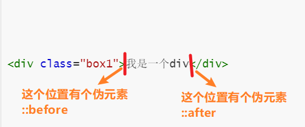
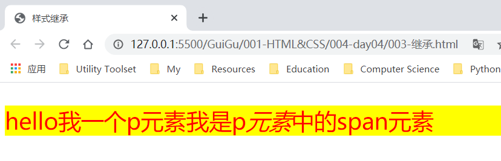
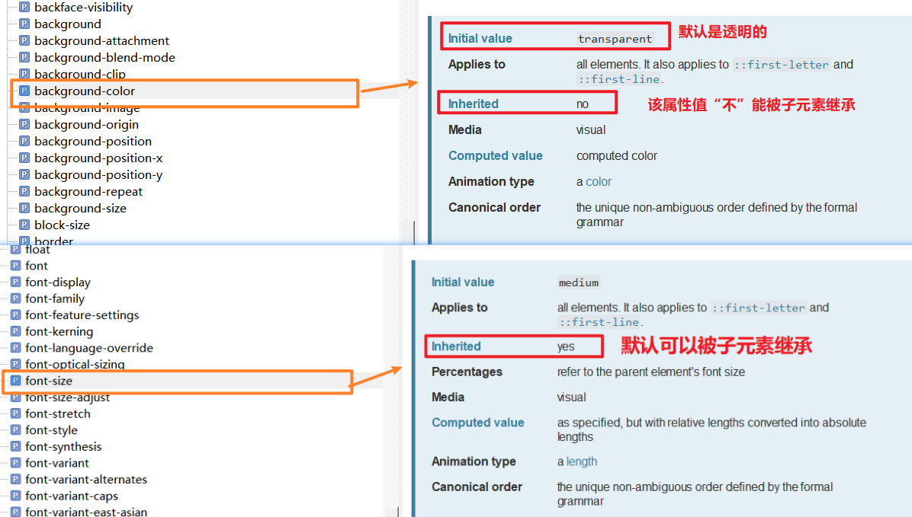
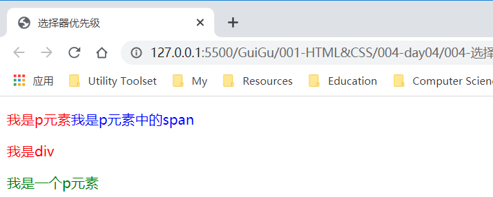
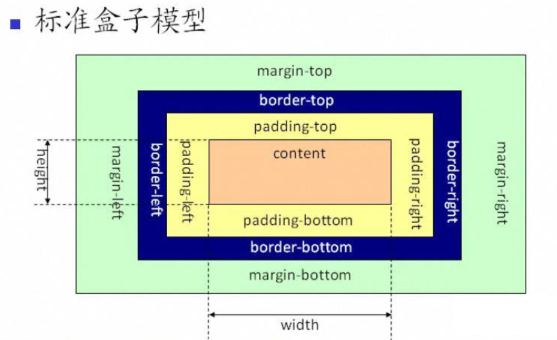
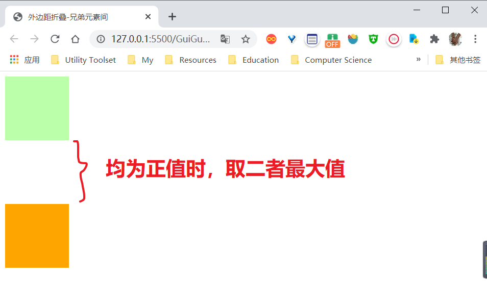
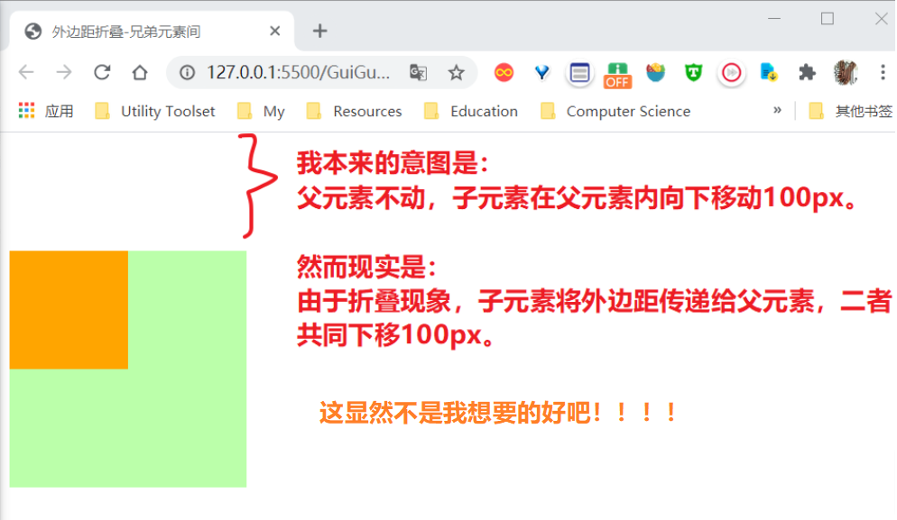
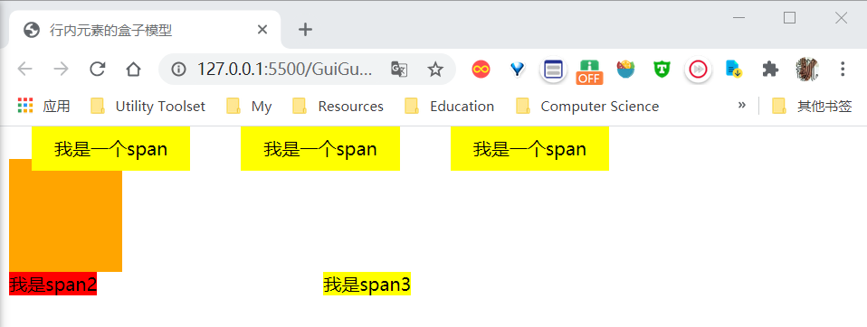
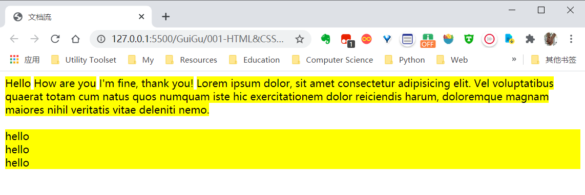

[toc]


# 01.三种引入方式

## 1.1 三种方式

* 内联样式
  * 使用style属性
* 绝不推荐使用：不方便修改维护，不方便复用
* 内部样式表
  * 在`<head>`内使用`<style></style>`标签
* 学习CSS语法时可用此方式
* 外部样式表
  * 使用link标签引入
  * 强烈推荐

## 1.2 代码示例

**HTML部分**

```html
<!DOCTYPE html>
<html lang="en">

<head>
    <meta charset="UTF-8">
    <title>样式</title>

    <!--    
        【第二种方式:style标签】
        可以将样式编写到style标签中（style标签需要写在head里）
        将样式编写到style标签中，然后通过CSS选择器选中指定的元素并为其设置样式。将HTML和CSS代码分离开，使CSS样式可以复用，并且方便后期的维护
        但是，使用style标签只能对该页面内使用，不能对其他HTML文档生效，这是就要用第三种方式了
    -->

<!--<style>
        p{
            color:blue;
            font-size: 25px;
            background-color: yellow;
        }
        
        h1{
            color: yellowgreen
        }
    </style> 
-->


    <!--
        【第三种方式，外链CSS】
        还可以将CSS代码编写到一个外部的CSS文件中然后通过link标签将其引入到页面中
        
        将CSS写在外部的样式表中，使结构和表现完全分离，
        可以在不通的页面中对样式表进行复用，方便后期的维护
        
        将样式表写在外部文件中，可以充分的利用到浏览器的缓存机制，进而加快页面的加载速度，提高用户体验
    -->
    <link rel="stylesheet" href="style.css">
</head>

<body>

    <!--   
        CSS（层叠样式表）   
            - 用来处理网页的表现
            - 网页中所有外在显示效果都由CSS来控制
    -->

    <!--
        【第一种方式：使用标签的style属性】   
        将样式直接编写到style属性中这样会导致结构和表现耦合，不方便代码的复用，
        并且不方便后期的维护（修改的时候每一处都得手动改！），所以在开发中永远不要使用内联样式！！！
    -->

    
<!-- 
    <p style='color: red;font-size: 30px;'>落霞与孤鹜齐飞，秋水共长天一色</p>
    <p style="color: yellow;font-size: 60px;">今天天气真不错</p>
    <p style="color: skyblue;font-size: 90px;">我们大家来上课</p> 
-->


    <h1>我是一个标题</h1>

    <p>落霞与孤鹜齐飞，秋水共长天一色</p>

    <p>今天天气真不错</p>

    <p>我们大家来上课</p>
    <p>我们大家来上课</p>
    <p>我们大家来上课</p>
    <p>我们大家来上课</p>
    <p>我们大家来上课</p>
    <p>我们大家来上课</p>
    <p>我们大家来上课</p> 

</body>

</html>
```

**CSS部分**

```css
p{
    color:blue;
    font-size: 25px;
    background-color: yellow;
}

h1{
    color: yellowgreen
}
```


# 02.基本语法

详情见下方代码中的注释~

```html
<!DOCTYPE html>
<html lang="en">

<head>
    <meta charset="UTF-8">
    <title>Document</title>
    <style>
        /*
            CSS中的注释，注释中的内容会被浏览器忽略
        
            CSS的语法：
                CSS语法由两部分组成：选择器+声明块
        
                选择器
                    - 通过选择器可以选中页面中的指定元素
                    - 比如 
                        p 选中所有p元素
                        div 选中所有div元素
                声明块：
                    - 整体是一对大括号
                    - 声明块由一个一个的声明组成
                    - 声明是一个名值对结构：
                        样式名对应一个样式值
                        名和值之间使用:连接，使用;结尾
                    - 声明块中的所有样式将会应用到其前边的选择器所对应的元素上
        */

        p {
            color: red;
            font-size: 50px;
        }
    </style>
</head>

<body>

    <p>今天天气真不错</p>

</body>

</html>
```

上面注释已说明，CSS语法由两部分组成：**选择器+声明块**。后面的学习就这两个方向展开~


# 03.选择器-分类

## 3.1基础选择器

* 元素选择器
* id选择器
* 类选择器
* 通配选择器
* 属性选择器

**代码示例：前四种选择器**

```html
<!DOCTYPE html>
<html lang="en">

<head>
    <meta charset="UTF-8">
    <title>基础选择器</title>
    <style>
/*    
    【情境一】为所有的p元素，设置一个字体颜色为红色
    
    【元素选择器】
        作用：根据标签名来选中指定的元素
        语法：标签名
        例子：p{} div{} span{}
*/

/*
    h1{
        color: green
    }

    p{
        color: red;
    }
*/

/*        
    【情境二】为第二行设置一个字体大小为50px 
    
    【id选择器】
        作用：根据元素的id属性值，选中一个元素
        语法：#id
        例子： #p1{}  #box{} 
                
*/

/*
    #p1{
        font-size: 50px
    }
*/


/*
    【类选择器】
        作用：根据元素的class属性选中元素
        语法：.class
        例子：.p1{} .box{}
*/

/*
    .p5{
        background-color: greenyellow
    }
    
    .p6{
        font-size: 40px
    }
*/


/*        
    【通配选择器】
        作用：选中页面中的所有元素
        语法：*
*/

/*      
        * {
            color: red
        } 
*/

    </style>
</head>

<body>
    <h1>滕王阁序</h1>
    <p>落霞与孤鹜齐飞，秋水共长天一色</p>
    <p id="p1">落霞与孤鹜齐飞，秋水共长天一色</p>
    <p id="p2">落霞与孤鹜齐飞，秋水共长天一色</p>
    <p id="p3">落霞与孤鹜齐飞，秋水共长天一色</p>
    <p id="p4">落霞与孤鹜齐飞，秋水共长天一色</p>

    <!--   
        除了id属性，也可以为元素添加一个class属性
            - class的作用的是为元素进行分类
            - 拥有相同class属性的元素属于同一类元素
            - 设置方式也和id基本一致，不同的是
                - class属性可以重复使用
                - 也可以同时为一个元素设置多个class
    -->
    <p class="p5 p6 p7">落霞与孤鹜齐飞，秋水共长天一色</p>

    <p class="p5">落霞与孤鹜齐飞，秋水共长天一色</p>

    1345

</body>

</html>
```

**代码示例：属性选择器**

* `[attr]`：选中含有该属性名的所有元素
* `[attr=value]`：选中含有attr属性，且属性值为精确value的元素
* `[attr=value i]`：选中含有attr属性，且属性值为精确value的元素；`i`表示忽略大小写。
* `[attr^=value]`：选中含有attr属性，且属性值以value开头的元素
* `[attr$=value]`：选中含有attr属性，且属性值以value结尾的元素
* `[attr*=value]`：选中含有attr属性，且属性值含有value的元素

```html
<!DOCTYPE html>
<html lang="en">

<head>
    <meta charset="UTF-8">
    <title>属性选择器</title>
    <style>
    /*        
        属性选择器，根据元素的属性来选中元素
            [属性名] 获取含有指定属性的元素
    
    */

    /*  
        [title]{
            color: red;
        }
    */

    /*
        [title='hello']{
            color: red;
        }
    */

    /*
        [title^='h']{
            color: red;
        }
    */

    /*
        [title$='h']{
            color: red;
        }
    */

    /*
        [title*='h']{
            color: red;
        }
    */
    
        [title='hello' i] {
            color: red;
        }
    </style>
</head>

<body>

    <div title="Hello">我是一个div</div>

    <div>我也是一个div</div>

    <p title='hgood'>我是一个p元素</p>

</body>

</html>
```


## 3.2 复合选择器

* 并集选择器
* 交集选择器

```html
<!DOCTYPE html>
<html lang="en">

<head>
    <meta charset="UTF-8">
    <title>复合选择器</title>
    <style>
        /* =====================并集选择器================= */
        /*        
            【情境三】为class为cat，id为p4的所有元素设置一个背景颜色为黄色
            【选择器分组(并集选择器)】
                作用：可以同时为多个选择器设置同样的样式
                语法：选择器1, 选择器,...选择器N
                例子：#p2, div, span {}
        */
        
        /* 
            .cat, #p4 {
                background-color: yellow
            } 
        */

        /* ====================交集选择器================== */
        /*      
            【情境需求】为class为box的div设置一个字体大小
            【交集选择器】
                作用：选中同时符合多个选择器的元素
                语法：选择器1选择器2...选择器N
                例子：div.box{}
        */
        
        /* 
            div.box {
                font-size: 50px;
                color: red;
            } 
        */


        /*        .box  *.box  */

        /*  div#box{} 不建议这么创建规则*/
    </style>
</head>

<body>
    <!-- ==============并集选择器==================== -->
    <p id="p1">落霞与孤鹜齐飞，秋水共长天一色</p>
    <p class="cat">落霞与孤鹜齐飞，秋水共长天一色</p>
    <p class="cat">落霞与孤鹜齐飞，秋水共长天一色</p>
    <p id="p4">落霞与孤鹜齐飞，秋水共长天一色</p>
    <p>落霞与孤鹜齐飞，秋水共长天一色</p>
    <p>落霞与孤鹜齐飞，秋水共长天一色</p>
    <p>落霞与孤鹜齐飞，秋水共长天一色</p>
    <p>落霞与孤鹜齐飞，秋水共长天一色</p>

    <!-- ==============交集选择器==================== -->
    <div class="box">
        我是一个div
    </div>

    <p class="box">
        我是一个p
    </p>

    <div class="box"></div>
    <div id="z3"></div>
</body>

</html>
```


## 3.3 关系选择器

* 后代选择器
* 子元素选择器
* 兄弟选择器

```html
<!DOCTYPE html>
<html lang="en">

<head>
    <meta charset="UTF-8">
    <title>关系选择器</title>
    <style>

/* ======================后代元素选择器===================== */
    /*      
        【情境需求】为div中的span元素设置一个字体颜色
        【后代元素选择器】
            作用：选中指定元素的指定后代
            语法：祖先 后代{}
            例子： div span{}
    */
    /*
        div span {
            color: chocolate
        }
    */

    /*
        .box1 span{
            color: yellowgreen
        }
    */

/* ======================子元素选择器===================== */
    /*  
        【情境需求】为div的子元素span设置一个字体颜色
        【子元素选择器】
            作用：选中指定父元素的指定子元素
            语法：父元素 > 子元素
        
    */

    /*
        div > span{
            color: aqua
        }
    */

/* ======================兄弟选择器===================== */
    /*        
        【兄弟元素选择器】
            作用：选中指定的元素的兄弟元素
        语法：兄 + 弟 {}
            选择紧随其后的一个弟元素
        语法：兄 ~ 弟 {}
            选择其后边所有弟元素
    */

    /*
        span + p{
            color: red
        }
    */

        span~p {
            color: red
        }

    </style>
</head>

<body>
    <!--  
        元素间的关系：
            父元素
                - 直接包含子元素的元素
            子元素
                - 直接被父元素所包含的元素
            祖先元素
                - 直接或间接包含后代元素的元素
                - 父元素也属于祖先元素
            后代元素
                - 直接或间接被祖先元素包含的元素
                - 子元素也属性后代元素
            兄弟元素
                - 拥有相同父元素的元素
    -->

    <div class="box1">
        我是div
        <span>我是div中的span</span>
        <p>
            我是div中的p
            <span>
                我是p中的span
            </span>
        </p>

        <p>我是另一个p元素</p>
    </div>

    <div>
        <span>
            我是body中的span
        </span>
    </div>

    <p>我是body中的p元素</p>

</body>

</html>
```


## 3.4 伪类选择器

```html
<!DOCTYPE html>
<html lang="en">

<head>
    <meta charset="UTF-8">
    <title>伪类选择器</title>
    <style>
    /*   将div中的第一个p元素的字体颜色设置为红色*/
    
    /*
        div p:first-child{
            color: red;
        }
    */

    /*
        div p:first-of-type{
            color: red;
        }
    */

    /*
        p:last-child{
            color: blueviolet
        }
    */

    /*
        p:last-of-type{
            color: lawngreen
        }
    */

    /*
        p:nth-child(even){
            color: red
        }
    */

        p:nth-child(2n+1) {
            color: red
        }

    /*
        p:only-child{
            color: yellow
        }
    */

        p:only-of-type {
            color: yellow
        }

        .box1 {
            width: 100px;
            height: 100px;
            border: 1px solid black;
        }

        .box2 {
            width: 100px;
            height: 100px;
            border: 1px solid red;
        }

        div:empty {
            background-color: red;
        }

        p:not(.p1) {
            background-color: skyblue;
        }
    </style>
</head>

<body>

    <!-- 
        【伪类选择器】 一般用来表示元素的一些特殊的“状态”或者特殊的“位置”
        :first-child
            - 表示第一个子元素（在所有的子元素中查找）
        :first-of-type  
            - 同类型中的第一个子元素
        :last-child
        :last-of-type
        :nth-child()
            - 参数：第n个子元素; odd或表示单数; even表示双数; n表示全选
        :nth-of-type()
            - 同类型的第n个子元素 ...


        :only-child
            - 唯一的一个子元素
        :only-of-type
            - 同类型中唯一的一个子元素
        :empty
            - 匹配空元素(什么都没有才叫空，有空格也不行！！)
        :not()
            - 否定伪类，表示除了
    -->

    <div>
        <p>我是第二个p元素</p>
        <p>我是第三个p元素</p>
        <p class='p1'>我是第一个p元素</p>
        <p>我是第一个p元素</p>
        <p>我是第一个p元素</p>
        <p>我是第一个p元素</p>
        <p>我是第一个p元素</p>
        <p>我是第一个p元素</p>
        <p>我是第一个p元素</p>
        <p>我是第一个p元素</p>
    </div>

    <div>
        <p>我是下边div中的p元素</p>
        <span></span>
    </div>

    <div class='box1'>
        <p>p元素</p>
    </div>
    <div class='box2'></div>

    <!--       <p>hello</p>-->
</body>

</html>
```

## 3.5 `<a>`的伪类

```html
<!DOCTYPE html>
<html lang="en">

<head>
    <meta charset="UTF-8">
    <title>a的伪类</title>
    <style>
        a:link {
            color: green;
            font-size: 50px;
        }

        a:visited {
            color: red;
            /*            
                由于隐私的原因，visited这个伪类
                只能修改字体的颜色，其余样式都不能修改
            */
            /*            font-size: 20px;*/
        }

        a:hover {
            color: yellow;
        }

        a:active {
            color: deepskyblue;
        }
    </style>
</head>

<body>
    <!--  
        :link
            - 正常的超链接（带有href的a标签）
            - 主要用来设置没有访问的链接的样式
        :visited
            - 访问过的超链接（只能修改字体的颜色）
        :hover
            - 鼠标移入的状态（不仅仅适用于超链接）
        :active
            - 鼠标正在点击的状态（不仅仅适用于超链接）
    -->

    <a href="https://www.baidu.com">访问过的</a>

    <br><br>
    <a href="https://www.sina.com">没访问过的</a>

</body>

</html>
```

## 3.6 伪元素选择器

[MDN文档-伪元素](https://developer.mozilla.org/en-US/docs/Web/CSS/Pseudo-elements)

### 3.6.1 关于伪元素

1、什么是伪元素？可以归纳为以下两种：

* 一些在特殊位置的且正常情况下看不见的元素。如：开始位置，结束位置
* 一些具有特殊含义的元素。如：第一行，第一个字母

如下图：



2、常见伪元素：

* `::before`：表示元素开头的位置
* `::after`：表示元素结尾的位置
* `::first-letter`：表示首字母
* `::first-line`：首行
* `::selection`：选中的内容

### 3.6.2 代码示例

```html
<!DOCTYPE html>
<html lang="en">

<head>
    <meta charset="UTF-8">
    <title>Document</title>
    <style>
        .box1::before {
            /* 通过content来为这个位置添加内容*/
            content: 'hello';
            color: red;
        }

        .box1::after {
            content: '你好';
            color: yellow;
        }

        p::first-letter {
            /*  color: red;*/
            font-size: 50px;
        }

        p::first-line {
            background-color: yellow;
        }

        p::selection {
            background-color: yellowgreen;
        }
    </style>
</head>

<body>
    <!--   
        伪元素主要表示一些特殊的元素
            ::before 表示元素开头的位置
            ::after 表示元素结尾的位置
            ::first-letter 表示首字母
            ::first-line 首行
            ::selection 选中的内容
    -->

    <div class="box1">我是一个div</div>

    <p>在我的后园，可以看见墙外有两株树，一株是枣树，还有一株也是枣树。
        这上面的夜的天空，奇怪而高，我生平没有见过这样奇怪而高的天空。他仿佛要离开人间而去，使人们仰面不再看见。然而现在却非常之蓝，闪闪地䀹着几十个星星的眼，冷眼。他的口角上现出微笑，似乎自以为大有深意，而将繁霜洒在我的园里的野花草上。
    </p>

</body>

</html>
```

# 04.选择器-优先级

## 4.1 样式继承

### 4.1.1 代码示例

```html
<!DOCTYPE html>
<html lang="en">

<head>
    <meta charset="UTF-8">
    <title>样式继承</title>
    <style>
        p {
            color: red;
            font-size: 50px;
            background-color: yellow;
        }
    </style>
</head>

<body>
    <!--   
        继承
            - 就像生活中后代会继承祖先财产一样
                在网页中后代元素也会继承到祖先元素上的样式
            - 为祖先元素所设置样式，也会同时应用到其后代元素上
        
            - 继承的存在大大的简化了样式的编写
                可以只为祖先元素设置样式，即可让所有后代元素都同时具有该样式
                在开发中可以将一些公共的样式，统一设置到祖先元素上，这样即可让所有的元素都具有该样式
        
            - 并不是所有的样式都会被继承，比如背景相关的样式都不会继承，还有布局相关(border/widhth/height...)...
    -->

    <p>hello我一个p元素<span>我是p<em>元素</em>中的span元素</span></p>

</body>

</html>
```

效果图如下：



上面说继承可以大大简化开发，举个简单的例子：

```html
<style>
    body{
        font-size: 15px;
    }
    /*因为font-size属性是可以继承的，所以上述代码一次性为全篇文字指定了字体大小*/
</style>
```


###  4.1.2 文档查看

如何通过参考文档查看是否支持继承？




## 4.2 优先级

一句话总结：**越具体的优先级越高**。

```html
<!DOCTYPE html>
<html lang="en">

<head>
    <meta charset="UTF-8">
    <title>选择器优先级</title>
    <style>
        .box1 {
            color: red !important;
        }

        #b1 {
            color: blue;
        }

        p.p1 {
            color: green
        }

        .p1 {
            color: yellow
        }

    /*
        p, div, #box1{
            
        }
    */

    /*        
        【样式冲突】
        当我们使用不同的选择器选择了相同的元素，
        而又为其同一个样式设置了不同的值，此时就发生了样式的冲突
        
        【权重计算方式】
        发生样式冲突时，显示哪个样式，由选择器的权重决定，权重高的优先显示，这其中内联样式的优先级是最高的，一旦设置则无法在样式表中修改
        如果为一个样式添加了 !important 则该样式会获得最高的优先级，将会优先于所有的样式显示。（慎用!!!）
            内联样式 1000(1,0,0,0)
            id选择器 100 (0,1,0,0)
            类和伪类  10 (0,0,1,0)
            元素      1 (0,0,0,1)
            通配选择器 0 (0,0,0,0)
            继承来的样式，没有优先级
        
        对于复合选择器来说，需要将所有的选择器的优先级相加然后在比较，
            优先级计算时不会超过其最大的数量级,分组选择器中的优先级是独立计算的。如果两个选择器的优先级相同，则使用靠下的样式。
        
        
    */

        * {
            color: blue;
        }

        p.p3 {
            color: orange
        }

        p.p2 {
            color: red;
        }
    </style>
</head>

<body>

    <p class="p2 p3">我是p元素<span>我是p元素中的span</span></p>

    <div id="b1" class="box1" style='color: orange'>

        我是div

    </div>

    <p class="p1">我是一个p元素</p>

</body>

</html>
```

效果如下：



# 05.声明块-设计基础

## 5.1 像素

```html
<!DOCTYPE html>
<html lang="en">

<head>
    <meta charset="UTF-8">
    <title>像素</title>
    <style>
    /*        
        长度单位：
            px（像素）
                - 显示器上的图像是由一个一个发光的小点点构成，
                    这个一个小点就是一个像素
                - 分辨率 1366 x 768
                - CSS像素 VS 物理像素
                    - 默认情况下，在pc中CSS像素和物理像素是相同的
                    - 在不同的显示器下，像素的大小也不尽相同
                        有的显示器像素点大
                        有的显示器像素点小
                        点越小越清晰
                    - 一些高清屏，会将像素放大，
                        使一个css像素可以对应多个物理像素(不然显示的就太小了！！)
        
        
            百分比(%)
                - 百分比会相对于【包含块】(可暂时理解为父元素)的指定属性去计算值
        			- 包含块：离当前元素最近的“块级祖先”元素
        		- 一般在一些【响应式开发】中会使用到百分比
        
    */
    
    
        .box1{
            width: 200px;
            height: 200px;
            background-color: red;
        }
        
        .box2{
            width: 50%;
            height: 50%;
            background-color: yellowgreen
        }
        
    </style>
</head>

<body>


    <div class="box1">

        <div class="box2"></div>
    </div>

</body>

</html>
```

## 5.2 颜色

颜色的几种表示方式

* 颜色名
  * red orange yellow blue green black ...
* RGB
  * 使用红绿蓝三种颜色的光的浓度来调配出不同的颜色
  * rgb(红色,绿色,蓝色)
    * 取值范围 0-255 /  0%-100%
  * rgba()
    * a(alpha)表示**不透明度**，其取值范围为0-1,1为完全不透明
* 十六进制数rbg值
  * 语法： #红色绿色蓝色
  * 范围： 00-ff
  * 例子：#ff0000 --> #f00 (如果每相邻两位都相同，则可缩写)
* HSL
  * 工业中设置颜色的方式
  * 从三个角度描述颜色
    * H 色相（0-360）
    * S 饱和度（0%-100%）
    * L 亮度（0%-100%）


```html
<!DOCTYPE html>
<html lang="en">

<head>
    <meta charset="UTF-8">
    <title>Document</title>
    <style>
        /* 
        几种表示颜色的方式：
            1.颜色名
            2.rgb()
            3.rgba()
            4.#xxxxxx
            5.hsl()
            6.hsla()
        */

        .box1 {
            width: 200px;
            height: 200px;
            /*            

                1.【使用颜色名】可是用颜色名来直接设置颜色
                    red green blue yellow orange ...
                2.【使用RGB值】可以使用RGB值来表示颜色
                    RGB值（Red Green Blue）
                    RGB值可以通过三种颜色不同的浓度来调配出其他的颜色
                    语法：rgb(红色,绿色,蓝色)
                    值的范围是 0-255
            */
            /*            background-color: rgb(0,255,0);*/
            /*            background-color: rgb(255,255,0);*/
            /*            background-color: rgb(255,255,255);*/
            /*            background-color: rgb(0,0,0);*/
            /*            background-color: rgb(100%,0%,0%);*/
            /*            background-color: rgb(167,192,220)*/
            /*            background-color: rgb(178, 84, 178)*/
            background-color: rgba(183, 54, 83, 0.5)
        }

        .box2 {
            width: 200px;
            height: 200px;

            /*            
            3.【使用十六进制的rgb值】
                语法：#红色绿色蓝色
                需要使用两位十六进制的数字来表示每种颜色的浓度
                    范围 00 - ff
            
            */
            /*            background-color: #0000ff*/
            /*            像aabbcc这种两两重复的颜色，可以进行简写*/
            /*            background-color: #aabbcc*/
            /*            background-color: #abc;*/
            /*            background-color: #bfa;*/
            /*            background-color: #29ABE2*/

            /*            
            4. 【使用HSL】
                h 表示色相 0 - 360
                s 表示饱和度 0% - 100% （值越大色越正，值越小色越灰）
                l 表示亮度 0% - 100% 
            
            */
            background-color: hsl(108, 100%, 83%);
        }
    </style>
</head>

<body>
    <div class="box1"></div>

    <div class="box2"></div>

</body>

</html>
```

# 06.声明块-盒子模型

## 6.1 什么是盒子模型？

### 6.1.1 盒子模型（框模型 box model） 

* **一切皆盒子**，浏览器在渲染页面时，它会将页面中的【每一个元素】都想象成是一个矩形的盒子。
* 想象成盒子以后，对于页面的布局就变成了【如何摆放盒子】
*  每一个盒子从内到外都有以下几个部分组成
  * 内容区（content）
    * 内容区决定这个盒子能装多少东西（子元素） 
  * 内边距（padding）
    * 内容区和边框之间的距离
  * 边框（border）
    * 盒子的边框
  * 外边距（margin）
    * 盒子距离其他盒子的距离

### 6.1.2 原理图



注意：height和width是**内容区**的的宽和高！！！


**题外话**

细心的你或许会发现，上图标题中有个诡异的定语——“标准”。难道还有不标准的吗？确实！

上图为W3C规范的标准盒模型，除此之外，IE浏览器有自己的盒模型，但由于微软已逐渐放弃IE，所以没有必要了解了~

## 6.2 盒模型之`border`

### 6.2.1 三个基本属性

* `border-width`
  * initial：medium
* `border-color`
  * initial：前景色（通过`color`属性设置，包括字体颜色和边框颜色）
* `border-style`
  * initial：none


### 6.2.2 示例代码一

该示例详细介绍了三个基本属性的属性值设置方式。

```html
<!DOCTYPE html>
<html lang="en">

<head>
    <meta charset="UTF-8">
    <title>盒子模型</title>
    <style>
        .box {
        /*            
            默认情况下，width和height指定的是元素的【内容区】的大小
        */
            width: 100px;
            height: 100px;

            /*            
            边框，是盒子的边界，出了边框就是盒子外部的
            边框相关的三个样式
                border-color 边框的颜色
                border-style 边框的样式
                border-width 边框的宽度
        
            边框会影响到盒子的可见框大小
        */

        /*            
            border-width表示边框的宽度
                - 可以通过该属性分别制定边框四个方向的宽度
                    border-width: 10px 20px 30px 40px;
                        如果我们指定了四个宽度，则会分别设置上右下左（顺时针方向）四个方向的边框的宽度
                    border-width: 10px 20px 30px;
                        三个值：上 左右 下
                    border-width: 10px 20px;
                        两个值：上下 左右
                    border-width: 10px;
                        一个值：上下左右
        */

            border-width: 30px;

        /*            
            border-color边框的颜色，可以分别指定四个边的颜色
                规则和border-width一样
        */

            border-color: red orange blue aqua;

        /*
            border-style 指定边框的样式

                solid 实线
                dotted 圆点状虚线
                dashed 虚线
                double 双线

                hidden  优先级最高，冲突时不显示其他属性
                none    优先级最低，冲突时以其他属性为主

                groove 深雕类型
                ridge  浮雕类型
                
                inset 按钮按下效果
                outset 按钮上浮效果
        */
            border-style: solid dotted dashed double;
            border-style: solid dotted dashed;
            border-style: solid dotted;
            border-style: solid;

            background-color: #bfa;
        }
    </style>
</head>

<body>
    <div class="box"></div>
</body>

</html>
```

### 6.2.3 示例代码二

该示例代码介绍了三个基本属性的默认值以及简写方式。

```html
<!DOCTYPE html>
<html lang="en">

<head>
    <meta charset="UTF-8">
    <title>盒模型-border</title>
    <style>
        .box1 {
            width: 100px;
            height: 100px;
            background-color: #bfa;
            /* ===============一、【默认值】=================== */
            /*   1、不指定宽度，边框也会有一个默认宽度 一般3px         */
            border-width: 10px;
            /*   2、也可以不指定颜色，不指定会默认使用前景色（使用color属性设置的颜色即为前景色，包括字体颜色和边框颜色）          */
            /* color: yellow; */
            /* border-color: red; */
            
            /*   3、border-style的默认值是none         */
            /* border-style: solid; */


            /* ===============二、【简写方式】=================== */
            /*            
                边框的简写属性 border
                    通过该属性可以同时设置四个方向边框的宽度、颜色、样式
                    并且没有顺序要求
                除了border还有四个 
                    border-top
                    border-right
                    border-bottom
                    border-left
            */

            /* border: 10px red solid; */
            /* border: red 10px solid; */
            /* border: solid red 10px ; */

        /*
            border-top: 10px red solid;
            border-left: 10px red solid;
            border-bottom: 10px red solid;
        */

            border: 10px red solid;
            border-right: none;
        }
    </style>
</head>

<body>

    <div class="box1"></div>

</body>

</html>
```

## 6.3 盒模型之`padding`

* **边框**和**内容区**之间的距离叫做内边距（padding）。
* 盒子的可见框大小由**内容区、内边距和边框**三者**共同**决定。

```html
<!DOCTYPE html>
<html lang="en">

<head>
    <meta charset="UTF-8">
    <title>盒模型之padding</title>
    <style>
        .box1 {
            width: 100px;
            height: 100px;
            background-color: #bfa;
            border: 10px red solid;
        /*            
            盒子的可见框大小由【内容区、内边距和边框】三者【共同】决定
            
            边框和内容区之间的距离叫做内边距（padding）
                一共有四个方向的内边距
                padding-top
                padding-right
                padding-bottom
                padding-left
            
            还可以通过padding来同时设置四个方向的内边距，规则和border-width一样
        */

        /*
            padding-top: 100px;
            padding-left:100px;
            padding-right:100px;
            padding-bottom:100px;
        */

            padding: 10px 20px 30px 40px;
            padding: 10px 20px 30px;
            padding: 10px 20px;
            padding: 10px;
        }

        .box2 {
            width: 100%;
            height: 100%;
            background-color: yellow;
        }
    </style>
</head>

<body>
    <div class="box1">
        <div class="box2"></div>
    </div>
</body>

</html>
```


## 6.4 盒模型之`margin`

### 6.4.1 `margin`基础

* 当前盒子和其他盒子之间的距离称为外边距。
* 外边距不会影响盒子的可见框的大小；但是外边距会影响到盒子实际占地的大小，影响盒子的位置。

* 由于在浏览器中默认情况下，元素是靠左靠上排列的，所以
  * 我们设置上、左外边距时，会移动元素自身
  * 而设置下和右外边距时，会移动其他元素
* 外边距可以使【负值】，如果是负值则元素会向相反方向移动
* 简写属性，margin 可以同时设置四个方向的外边距规则和padding一样

```html
<!DOCTYPE html>
<html lang="en">

<head>
    <meta charset="UTF-8">
    <title>盒模型之margin</title>
    <style>
        .box1 {
            width: 100px;
            height: 100px;
            background-color: #bfa;
        /*            
            当前盒子和其他盒子之间的距离称为外边距。
            外边距不会影响盒子的可见框的大小；但是外边距会影响到盒子实际占地的大小，影响盒子的位置。
            
            四个方向的外边距：
                margin-top
                margin-left
                margin-bottom
                margin-right ：对于块元素来说，该属性无用
                
            
            由于在浏览器中默认情况下，元素是靠左靠上排列的，
                所以我们设置上、左外边距时，会移动元素自身
                而设置下和右外边距时，会移动其他元素
            
        */

        /* 
            margin-top: 100px;
            margin-left: 100px;
            margin-bottom: 100px;
            margin-right: 100px; 
        */

        /*            
            外边距可以使【负值】，如果是负值则元素会向相反方向移动
        */
            
        /*  
            margin-top: -50px;
            margin-left: -50px; 
        */

        /*  
            简写属性，margin 可以同时设置四个方向的外边距
            规则和padding一样
        */
        }

        .box2 {
            width: 100px;
            height: 100px;
            background-color: orange;
        }
    </style>
</head>

<body>

    <div class="box1"></div>
    <div class="box2"></div>

    <!--    <span>Hello 我是span</span>-->

</body>

</html>
```


### 6.4.2 `margin`之水平方向布局

```html
<!DOCTYPE html>
<html lang="en">

<head>
    <meta charset="UTF-8">
    <title>margin之水平方向布局</title>
    <style>
        .box1 {
            width: 500px;
            height: 200px;
            border: 4px solid red;
        }

    /*        
        1、 子元素在父元素的位置是父元素的【内容区】
        2、 子元素在父元素中的水平方向的布局，“必须”满足如下等式：
            margin-left + border-left + padding-left + width + padding-right + border-right + margin-right = 父元素的width
        
        3、 如果七个值的和相加不等于父元素的width，则属于过度约束，浏览器会自动调整auto值以满足等式，如果没有auto值，则浏览器会自动调整【右外边距】的值。(注意，此时即使写了"margin-right=0"也没用！)
            
            eg：假设父元素width=500，则子元素的上述7个距离值为：
                0 0 0 100 0 0 0(400)
                0 0 0 510 0 0 0(-10)
                0 0 0 auto(500) 0 0 0
                100 0 0 auto(400) 0 0 0
                auto 0 0 100 0 0 0
                auto 0 0 100 0 0 auto

        4、 在水平方向，有【三】个值可以设置auto
                分别是 margin-left  width  margin-right
                设置为auto以后，浏览器会自动计算该属性的值
            
            - 如果三者均为auto：
                则子元素的可见框区域等于父元素的width
                margin-left = margin-right = 0
        
            - 如果将margin-left 或 margin-right 的一侧设置为auto，另一侧为零，width固定：
                则侧会设置尽量大的值
            
            - 如果left和right都设置auto，width固定:
                则会将两侧外边距设置相等的值，从而导致子元素在父元素中【水平居中】
    */
        .box2 {
            width: 100px;
            margin-left: auto;
            margin-right: auto;
            height: 100px;
            background-color: #bfa;
        }
    </style>
</head>

<body>
    <div class="box1">
        <div class="box2"></div>
        <span>hello</span>
    </div>
</body>

</html>
```

### 6.4.3 `margin`之垂直方向布局

```html
<!DOCTYPE html>
<html lang="en">

<head>
    <meta charset="UTF-8">
    <title>垂直方向布局</title>
    <style>
        .box1 {
        /* 宽度是auto时，子元素会占满父元素*/
            width: 200px;
        /* 高度是auto时，父元素的高度由其内容的高度决定*/
            height: 300px;
            background-color: #bfa;
        /*            
            - 如果不为父元素指定高度，则父元素会自动适应子元素的高度，确保能容纳所有的子元素
            
            - 如果为父元素指定了高度，则指定多少就是多少，此时如果子元素的大小超过了父元素，则会导致子元素从父元素中溢出。注意：溢出的子元素不会影响到页面的布局！！
            
            - 使用 overflow 来设置溢出内容的处理方式，可选值如下：
                - visible，默认值 溢出内容不会被裁剪直接在父元素外部显示
                - hidden，溢出的内容会被裁剪，超过父元素的不会显示
                - scroll，生成滚动条，可以通过滚动条查看完整内容。比较笨，即使不溢出，也会生成丑丑的滚动条，而“auto”便可解决此问题
                - auto，根据需要生成滚动条
        */

            overflow: auto;
        }

        .box2 {
            width: 800px;
            height: 100px;
            /* margin-bottom: 10px; */
            background-color: orange;

        }

        .box3 {
            width: 100px;
            height: 100px;
            background-color: red;

        }
        /*        
        垂直方向：
            mt + bt + pt + height + pb + bb + mb = 父元素的高度

            因为人们喜欢竖着滑屏，所以垂直方向上的高度往往不是固定的，因此上述等式远没有水平方向的严格：
                - 在水平方向中，浏览器会自动调整mb以使等式绝对成立
                - 而在垂直方向中：
                    - “7个值相加 <= 父元素高度”是可以的
                    - 如果把父元素高度设置为auto（很多时候确实是这么干的），则父元素的高度会适应7个值的和,否则有可能溢出
            
        */
    </style>
</head>

<body>

    <div class="box1">
        <div class="box2"></div>
        <div class="box3"></div>
    </div>

    <!--   <div style="height: 100px; background-color: red;"></div>-->

</body>

</html>
```

水平方向VS垂直方向

* auto默认设置不同
  * `margin-left=auto`, ` margin-right=auto`时，content会居中显示；而`margin-top=auto`，`margin-bottom=auto`等价于margin-top=margin-right=0，相当于啥也没写
  * margin-bottom设置为0，就确实是0了；而magin-right会被浏览器调整以满足等式，设不设置意义不大。

### 6.4.4 外边距折叠

**(1)外边距折叠**

* 定义：**垂直**方向上，**相邻**的**外边距**，会发生折叠。
  * 外边距折叠需要满足三个条件：垂直、相邻、外边距，缺一不可！
  *  后面解决问题也是依赖此三条件，如果我想消除折叠现象，破坏其一即可。
* 分类：
  * 兄弟元素间（下面3条规则的默认效果是我们想要的，保留折叠现象）
    * 若两外边距都是正值，则真实外边距取二者最大值
    * 若两外边距都是负值，则取绝对值的最大值
    * 若两外边距一正一负，则取二者之和
  * 父子元素间（下面1条规则的默认效果不是我们想要的，需破坏折叠现象）
    * 子元素的外边距会传递给父元素

**(2)示例代码-兄弟元素之间的折叠现象**

```html
<!DOCTYPE html>
<html lang="en">

<head>
    <meta charset="UTF-8">
    <title>外边距折叠-兄弟元素间</title>

    <style>
        .box1 {
            width: 100px;
            height: 100px;
            background-color: #bfa;
            margin-bottom: 100px;
        /*            
            外边距的折叠，垂直方向相邻的外边距，会发生外边距折叠现象。
                - 兄弟元素间的相邻外边距，会去两个外边距间的最大值（正值）
                - 如果是负外边界，则取绝对值较大的
                - 一正一负，取两个值的和
        */
        }

        .box2 {
            width: 100px;
            height: 100px;
            background-color: orange;
            margin-top: 100px;
        }
    </style>
</head>

<body>

    <div class="box1"></div>
    <div class="box2"></div>

</body>

</html>
```

效果如下：



**(2)示例代码-父子元素之间的折叠现象**

```html
<!DOCTYPE html>
<html lang="en">

<head>
    <meta charset="UTF-8">
    <title>外边距折叠-父子元素间</title>
    <style>
        .box1 {
            width: 200px;
            height: 200px;
            background-color: #bfa;

        }

        .box2 {
            width: 100px;
            height: 100px;
            background-color: orange;
            margin-top: 100px;
        /*            
            外边距的折叠
                兄弟元素
                    - 兄弟元素相邻会取最大值
                父子元素
                    - 父子元素的相邻垂直外边距，子元素的外边距会传递给父元素
        */
        }
    </style>
</head>

<body>

    <div class="box1">
        <div class="box2"></div>
    </div>

</body>

</html>
```

效果如下：




解决方案：

刚开始介绍外边距折叠现象时，我们已经说了，外边距折叠需要满足三个条件：垂直、相邻、外边距，缺一不可。因此如果我们想要消除折叠现象，破坏其一即可。

```css
/*===============方案一：破坏第三个条件，不使用外边距===========*/  
        .box1 {
            width: 200px;
            height: 100px; /* 注意此时将原height值减去padding-top，因为height只是内容区的高度，如若不改，整个可见区会被拉长 */
            background-color: #bfa;
            padding-top: 100px;  /*使用padding，不用margin照样可以解决问题*/

        }

        .box2 {
            width: 100px;
            height: 100px;
            background-color: orange;
        }

/*==========方案二：破坏第二个条件，父元素加入padding-top隔离，使二者外边距不再相邻=========*/
        .box1 {
            width: 200px;
            height: 200px;
            background-color: #bfa;
            padding-top: 1px;  /*这里加一个非常小的padding-top，使二者外边距不再相邻*/
        }

        .box2 {
            width: 100px;
            height: 100px;
            background-color: orange;
            margin-top: 100px;
        }
/*===========方案三：破坏第二个条件，父元素加入border-top隔离，使二者外边距不再相邻===========*/
        .box1 {
            width: 200px;
            height: 200px;
            background-color: #bfa;
            border-top:rgba(0, 0, 0, 0) solid 1px;
        }

        .box2 {
            width: 100px;
            height: 100px;
            background-color: orange;
            margin-top: 100px;
        }
```

* 上述解决方案中，第一种方案还勉强说得过去，可是第二种和第三种，却改变了原可见框的大小，虽然细微到肉眼难以察觉，可在逻辑上毕竟说不过去，那还有没有什么更完美的解决方案呢？别着急，后面我们会学习的~

## 6.5 行内元素的盒模型

上面介绍的盒模型**全部**是关于**块级元素**的，对于行内元素，它也有盒子模型，但与块级元素有许多不同之处：

* 行内元素**不支持**设置宽度(width)和高度(height)(设置了也没用)
* 行内元素可以设置padding，但是垂直方向的padding不会影响页面的布局，有可能会溢出
* 行内元素可以设置border，但是垂直方向的border不会影响页面的布局，同样有可能溢出
* 行内元素支持水平方向的margin，不支持垂直方向的；而且水平方向上的外边距没有折叠现象。

```html
<!DOCTYPE html>
<html lang="en">

<head>
    <meta charset="UTF-8">
    <title>行内元素的盒子模型</title>
    <style>
        .s1 {
            background-color: yellow;
        /*            
            1、行内元素不支持设置宽度和高度(设置了也没用)
        */

            width: 100px;
            height: 100px;

        /*            
            2、行内元素可以设置padding，但是垂直方向的padding不会影响页面的布局    
        */
            
            padding-left: 20px;
            padding-right: 20px;
            padding-top: 10px;
            padding-bottom: 10px;
        /*            
            3、行内元素可以设置border,但是垂直方向的border不会影响页面的布局
        */
            /* border: 30px red solid; */
        /*            
            4、行内元素支持水平方向的外边距，不支持垂直方向的
        */
            margin: 20px;
        }
        .s2 {
            background-color: red;
            margin-right: 100px;
        }
        .s3 {
            background-color: yellow;
            /* 5、水平方向相邻的外边距不会重叠，而是【求和】（即没有外边距折叠现象）*/
            margin-left: 100px;
        }
    </style>
</head>

<body>

    <span class="s1">我是一个span</span>
    <span class="s1">我是一个span</span>
    <span class="s1">我是一个span</span>
    <div style="width: 100px; height: 100px; background-color: orange"></div>

    <span class='s2'>我是span2</span><span class="s3">我是span3</span>
</body>

</html>
```

效果图如下：




## 6.6 文档流

### 6.6.1 定义

文档流是文档中可显示对象在排列时所占用的位置。

在文档流中：

* 行内元素默认从左到右流，遇到阻碍或者宽度不够自动换行，继续按照从左到右的方式布局。
* 块级元素单独占据一行，并按照从上到下的方式布局。

来一份示例代码：

```html
<!DOCTYPE html>
<html lang="en">

<head>
    <meta charset="UTF-8">
    <title>文档流</title>
    <style>
        .box1 {
            width: 100px;
            height: 100px;
            background-color: #bfa;
        }

        .box2 {
            background-color: yellow
        }

        span {
            background-color: yellow;
        }
    </style>
</head>

<body>


    <!--   
    文档流(标准流、常规流)   
        - 文档流是网页中的一个位置，默认情况页面中的所有元素都在文档流中排列。
        - 块元素在文档流中的特点
            1、自上向下进行排列（独占一行）
            2、默认宽度和父元素一样（值是auto，效果是100%）
            3、默认高度被内容撑开
        
        - 行内元素在文档流中的特点
            1、自左向右水平排列，如果一行中不足以容纳所有的元素则切换到下一行继续自作向右水平排列（和我们书写习惯一样）
            2、默认高度和宽度都被内容撑开
-->


    <span>Hello</span>
    <span>How are you</span>
    <span>I'm fine, thank you!</span>
    <span>Lorem ipsum dolor, sit amet consectetur adipisicing elit. Vel voluptatibus quaerat totam cum natus quos numquam iste hic exercitationem dolor reiciendis harum, doloremque magnam maiores nihil veritatis vitae deleniti nemo.</span>

    <br><br>
    <div class="box2">hello</div>
    <div class="box2">hello</div>
    <div class="box2">hello</div>

</body>

</html>
```

效果如下：



### 6.6.2 脱离文档流

